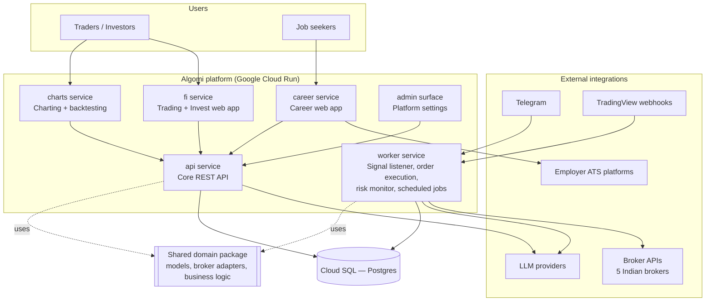

# Algomi — System Architecture

Algomi is a multi-product fintech platform covering algorithmic trading,
investment recommendations, an AI-assisted career copilot, and a charting /
backtesting engine, built as a set of independently deployable services on
Google Cloud.

**This repository contains no product source code.** It documents the system
design — service boundaries, data flow, and infrastructure — as a reference
and portfolio artifact. Diagrams are Mermaid, rendered natively by GitHub.

## Products

| Product | Surface | What it does |
|---|---|---|
| Trading | `trade.algomi.in` | Signal-driven algo trading: ingests trade calls from Telegram/TradingView, executes across multiple Indian brokers, tracks live P&L and risk |
| Invest | `invest.algomi.in` | Longer-horizon investment recommendations, served from the same codebase as Trading via host-aware routing |
| Career | `career.algomi.in` | AI job-search copilot — resume tailoring, application tracking, job aggregation across employer ATS platforms |
| Charts | `charts.algomi.in` | Custom Pine-subset scripting engine, live charting, and strategy backtesting |
| Admin | `admin.algomi.in` | Platform configuration: LLM provider registry, feature toggles, user/account administration |

One login and account system spans all products.

## High-level architecture

## Documentation

- [System overview](docs/01-system-overview.md) — products, service responsibilities, shared components
- [Trading signal flow](docs/02-trading-signal-flow.md) — how a signal becomes a broker order
- [Data & schema evolution](docs/03-data-and-schema.md) — single shared database, migration-driven schema
- [Infrastructure & deployment](docs/04-infrastructure-and-deployment.md) — Cloud Run, CI/CD, secrets
- [Tech stack](docs/05-tech-stack.md)
- [Design decisions & trade-offs](docs/06-design-decisions.md)

## Why this design

- **Shared core, independent surfaces.** Product web apps and the background
  worker all depend on one internal domain package (database models, broker
  adapters, signal parsing) rather than reimplementing business logic per
  service — schema and broker-behavior changes ship once.
- **Host-aware routing over service duplication.** Trading and Invest are the
  same Next.js application; middleware picks the product experience from the
  request host, avoiding a second codebase for a UI variant.
- **Broker integration as a plugin boundary.** Each broker (order placement,
  auth, WebSocket order updates) implements one adapter interface, so adding
  a broker doesn't touch signal parsing or risk logic.
- **Config-driven LLM routing.** Model/provider selection is a database-backed
  registry with task-based precedence, not a hardcoded SDK call — swapping or
  adding a provider is an admin-panel change. Requests carrying personal data
  are structurally restricted to self-hosted models.

## License

MIT — see [LICENSE](LICENSE). This is a documentation-only portfolio
repository; the actual Algomi codebase is private.
