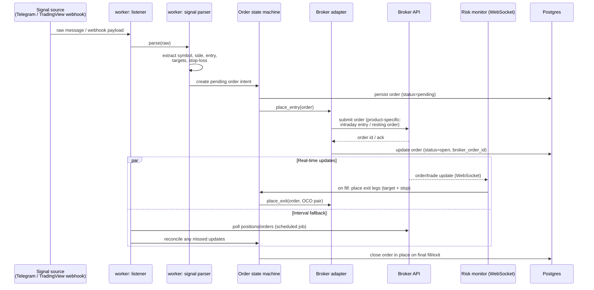

# Trading Signal Flow

How a trade call becomes a live broker order, end to end.

## Design points

- **One row per trade, closed in place.** An order's lifecycle (pending →
  open → exited) updates a single database row rather than inserting a new
  row per state change, so P&L and history queries don't need to reconstruct
  state from an event log.
- **Real-time path + scheduled fallback.** A WebSocket connection reacts to
  fills immediately (to place exit legs with minimal slippage), while a
  scheduled reconciliation job catches anything the socket missed —
  dropped connections, missed messages, restarts.
- **Broker adapter boundary.** `place_entry` / `place_exit` / `get_orders`
  are the same interface regardless of broker; product-type differences
  (e.g. intraday vs. resting entry orders, OCO vs. two separate exit orders)
  are handled inside each adapter, not in the signal parser or state
  machine.
- **Segment-aware routing.** A user can route options signals to one broker
  and equity/cash signals to another; the state machine picks the adapter
  per order based on instrument segment and the user's configured routing.
