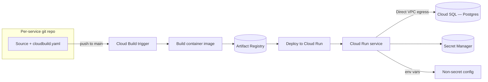

# Infrastructure & Deployment

## Per-repo, per-service pipelines

Each service repo owns its own `cloudbuild.yaml` and Cloud Build trigger.
Pushing to `main` builds and deploys that service independently — there's
no monorepo-wide build. This keeps deploys small and fast (only the
changed service redeploys) at the cost of coordinating multi-service
changes (e.g. an API contract change) across two pipelines by hand.

The shared domain package (see
[System overview](01-system-overview.md#shared-domain-package)) is built and
published to Artifact Registry as its own versioned artifact, and pulled by
`api` and `worker` at build time — so a shared-logic change is one publish
plus two redeploys, not a merge into either service's tree.

## Runtime

- **Compute:** Google Cloud Run, one service per product/backend, scaled by
  request volume (frontends, API) or by a scheduled uptime window tied to
  market hours (the worker, which doesn't need to run 24/7).
- **Database:** Cloud SQL for Postgres, reached over Direct VPC egress
  rather than a VPC connector — lower latency, no connector capacity to
  provision separately from the service itself.
- **Secrets:** Most configuration is plain Cloud Run environment variables;
  a small number of high-sensitivity values (app-level signing keys) live in
  Secret Manager and are mounted at deploy time. Config changes deploy with
  an env-var *merge*, not a full replace, so an unrelated deploy can't
  silently drop a variable another change added.
- **Domain routing:** A single frontend deployment can serve multiple public
  domains (e.g. `trade.algomi.in` and `invest.algomi.in`) via Cloud Run
  domain mappings plus host-aware middleware in the app itself, rather than
  deploying the same code twice under different names.

## Cost shape

Cloud Run's fractional-CPU billing means a service that logs or does
background work while "idle" (health checks, keep-alive pings, chatty
logging) is billed for that CPU time even with zero real traffic. The
practical lesson: idle-time compute, not request volume, is what drives
Cloud Run cost at this scale — worth checking `billable_instance_time`
per service rather than request counts when a bill looks off.
